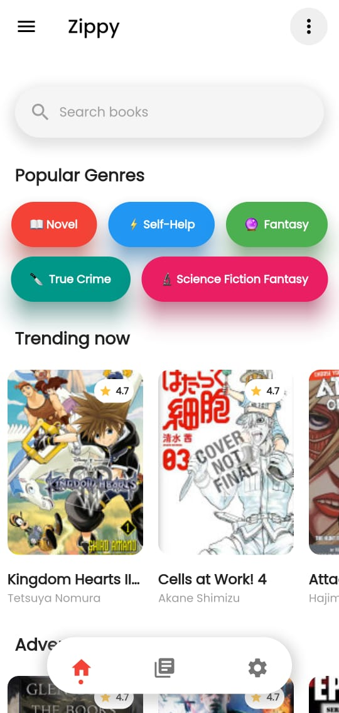
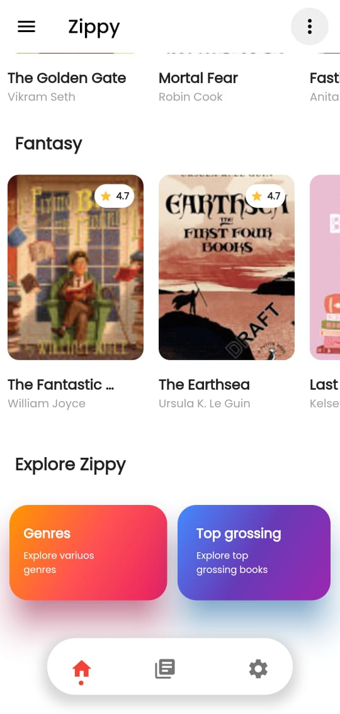
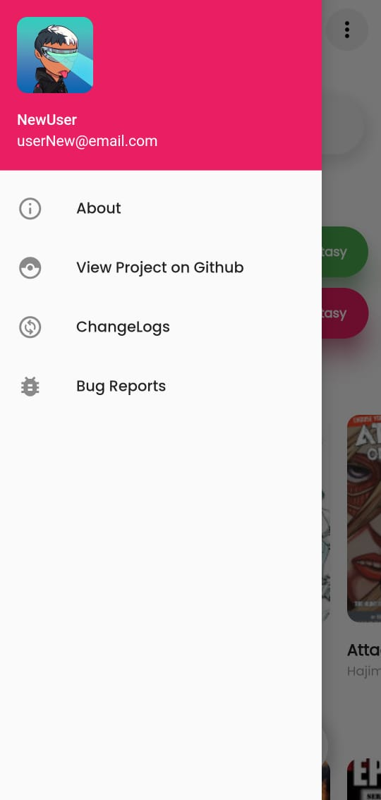
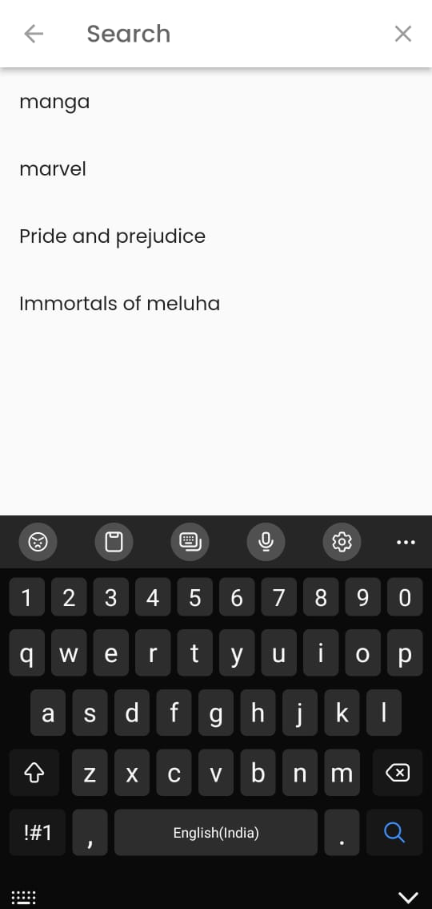
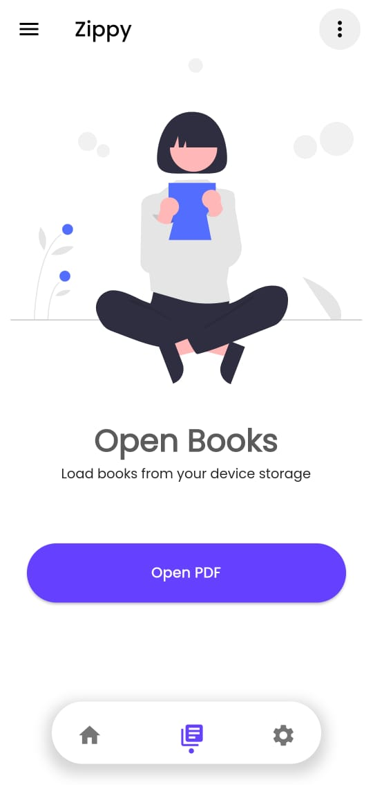
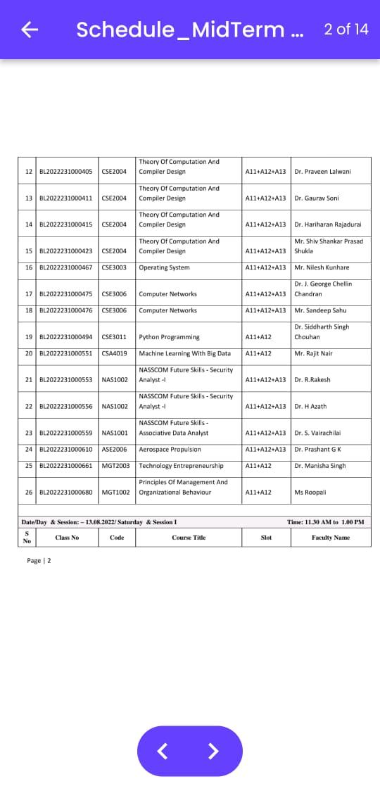

# 📖📖 Zippy - Flutter eLibrary App 

A simple Flutter app to explore books. The Books included in the app are provided by the google books api.

## 📸 ScreenShots

<!--  -->
 

|                                                  |                                                  |
| -------------------------------------------------| -------------------------------------------------|
|   |   |
|   |   |
|   |   |
|   |   |
